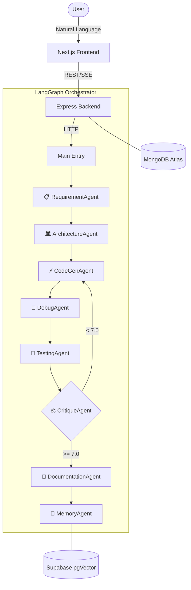

# 🤖 DevAgents OS: The Autonomous Software Engineer 🤖

> **Natural Language Requirements → Production-Ready MERN Applications**  
> A multi-agent orchestrator that plans, codes, debugs, tests, and documents full-stack software—autonomously.

---

[](https://nodejs.org)
[](https://python.org)
[](https://nextjs.org)
[](LICENSE)
[](https://langchain-ai.github.io/langgraph/)

## 🌟 Key Features

- **🚀 Redesigned Unified Agent Feed:** Watch agents work in real-time with a unified, scrollable activity feed that renders code, docs, and architecture inline.
- **🧠 Hierarchical Multi-Agent System:** 8 specialized agents collaborating via **LangGraph** to ensure high-quality output.
- **🔄 Auto-Critique & Refactor Loop:** Integrated quality scoring (0-10) with automatic re-coding if the critique score falls below 7.
- **📁 Full-Stack MERN Boilerplate:** Generates everything from MongoDB schemas and Express controllers to Next.js components and Jest tests.
- **🕵️ Debug & Security Audit:** Dedicated agents specializing in finding root causes and security vulnerabilities before completion.
- **✨ Professional UI/UX:** A sleek, premium dashboard built with Framer Motion, dynamic animations, and dark mode.

---

## 🏛️ System Architecture



---

## 🤖 The Specialist Agents

| Agent                | Responsibility                                          | Key Model         |
| :------------------- | :------------------------------------------------------ | :---------------- |
| **📋 Requirement**   | Extracts features, constraints, and user stories.       | Claude 3.5 Sonnet |
| **🏛️ Architecture**  | Designs folder structure, API contracts, and DB schema. | GPT-4o            |
| **⚡ Code Gen**      | Writes the actual React/Node.js/Mongoose code.          | GPT-4o            |
| **🐛 Debug**         | Audits code for logic errors and security gaps.         | GPT-4o            |
| **🧪 Testing**       | Generates Jest/Supertest suites and integration tests.  | GPT-4o            |
| **⚖️ Critique**      | A 3-phase debate (Critic vs Defender) to score quality. | GPT-4o            |
| **📝 Documentation** | Produces high-quality READMEs and API guides.           | Claude 3.5 Sonnet |
| **🧠 Memory**        | Distills session insights into a vector database.       | Gemini Flash      |

---

## 🛠️ Tech Stack

- **Frontend:** Next.js 14 (App Router), TypeScript, Zustand, Framer Motion, SyntaxHighlighter.
- **Backend:** Node.js, Express, MongoDB (Mongoose), JWT Auth, Server-Sent Events (SSE).
- **Core Engine:** Python, LangGraph, FastAPI, LangChain.
- **AI Models:** GPT-4o, Claude 3.5 Sonnet, Gemini Flash, Ollama.
- **Vector DB:** Supabase (pgVector) for long-term agent memory.

---

## 🚀 Getting Started

### 📋 Prerequisites

- Node.js 18+ & npm
- Python 3.11+ & pip
- MongoDB (Local or Atlas)
- Supabase (Vector store enabled)
- API Keys: `OPENAI_API_KEY`, `ANTHROPIC_API_KEY`, `GOOGLE_API_KEY`

### ⚙️ Quick Setup (Windows)

1. **Clone the Repo:**
   ```bash
   git clone https://github.com/Pranesh003/DevAgent_OS.git
   cd DevAgent_OS
   ```
2. **Configure Environment:**
   Copy `.env.example` to `.env` and fill in your API keys.
3. **One-Click Start:**
   Simply run the dev script:
   ```bash
   .\start_windows_dev.bat
   ```

### 🐳 Run with Docker

```bash
docker-compose up --build
```

---

## 📡 API Endpoints

### 🔐 Authentication

- `POST /api/auth/signup` - Register a new account.
- `POST /api/auth/login` - Authenticate and receive JWT.

### 🤖 Agents & Workspace

- `POST /api/agents/run` - Trigger the 8-agent pipeline.
- `GET /api/agents/stream/:sessionId` - Subscribe to live agent updates (SSE).
- `GET /api/agents/results/:sessionId` - Retrieve generated code, docs, and diagrams.

---

## 🤝 Contributing

Contributions are welcome! Please fork the repo, create a branch, and submit a PR for any improvements.

---

## 📄 License

This project is licensed under the MIT License - see the [LICENSE](LICENSE) file for details.

---

_Built with ❤️ for the future of autonomous software engineering._
